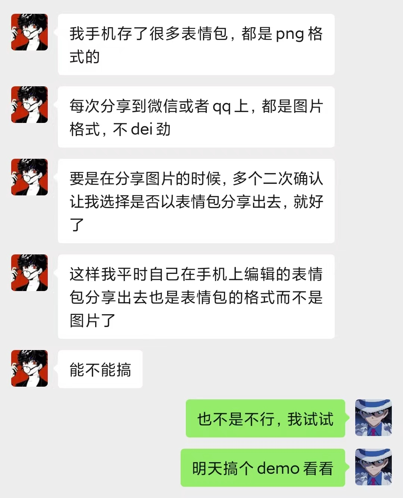
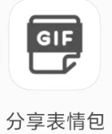

# 图片转表情包
## 需求来源
事情是这样的，我有一个死宅朋友，他收集了很多表情包，但是微信发出去的时候，却都是以图片格式发出去的，这非常的不方便，于是他委托我写一个分享的插件，将图片格式在分享的时候，可以转为表情包分享到微信。

## 安装
点击release页面，找到最新版，下载到手机中安装。安装好了之后，分享图片的时候，在分享目标中可以找到下面这个icon，点击即可转为表情包然后再进行分享。

## 使用方式

<video controls>  
  <source src="./resources/video1.mp4" type="video/mp4"> 
  您的浏览器不支持Video标签。  
</video>

